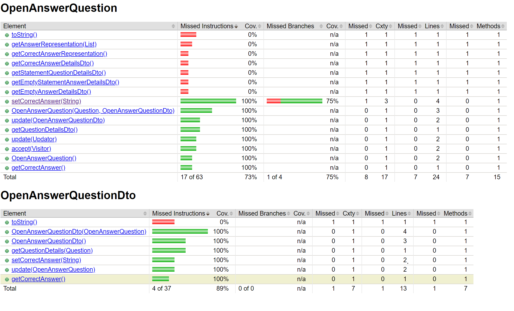
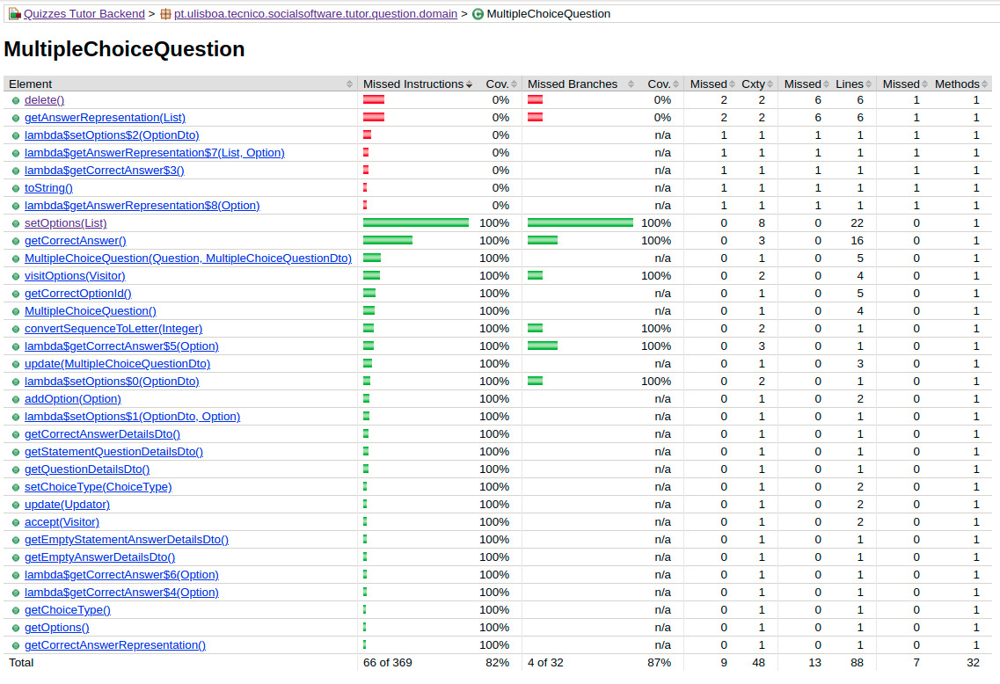
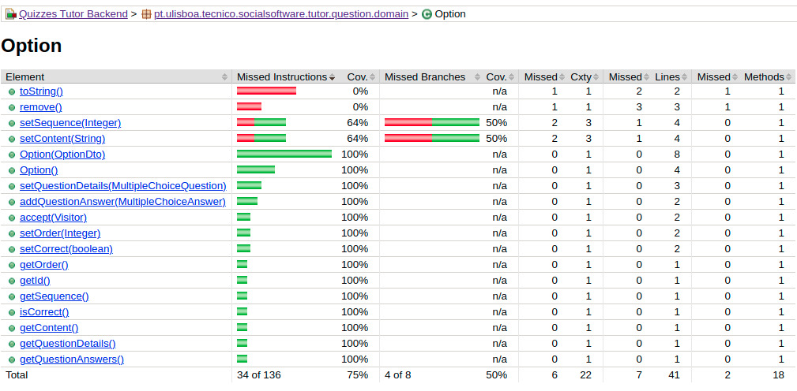
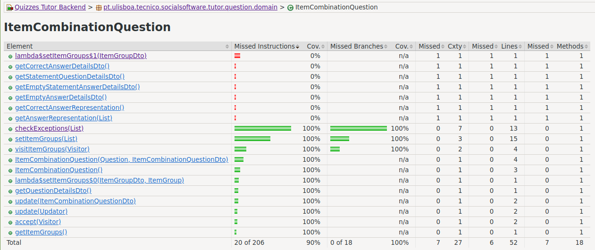
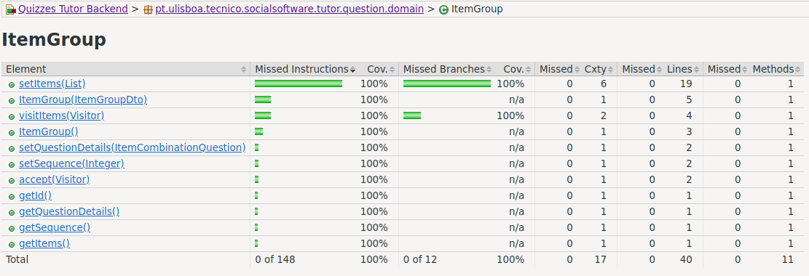
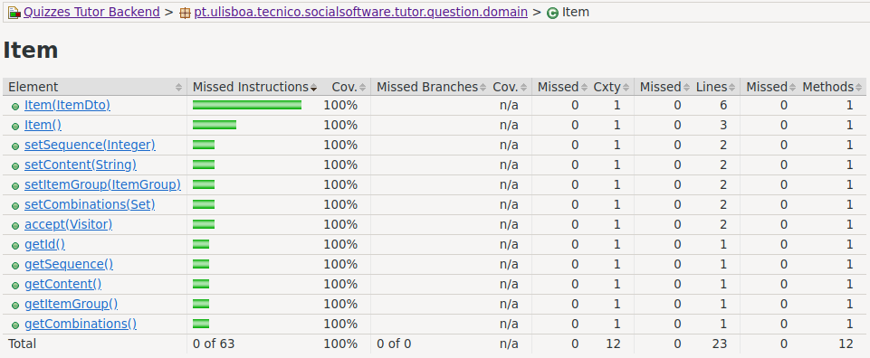

# ES21 P1 submission, Group 06

## Feature PRA

### Subgroup
 - Martim Pimentel, 93738, MartimPimentel
   + Issues assigned: [#9](https://github.com/tecnico-softeng/es21-g06/issues/9), [#10](https://github.com/tecnico-softeng/es21-g06/issues/10),[#11](https://github.com/tecnico-softeng/es21-g06/issues/11), [#12](https://github.com/tecnico-softeng/es21-g06/issues/12), [#19](https://github.com/tecnico-softeng/es21-g06/issues/19), [#20](https://github.com/tecnico-softeng/es21-g06/issues/20), [#21](https://github.com/tecnico-softeng/es21-g06/issues/21), [#22](https://github.com/tecnico-softeng/es21-g06/issues/22), [#24](https://github.com/tecnico-softeng/es21-g06/issues/24), [#25](https://github.com/tecnico-softeng/es21-g06/issues/25), [#26](https://github.com/tecnico-softeng/es21-g06/issues/26), [#27](https://github.com/tecnico-softeng/es21-g06/issues/27)
 - Martim Belo, 94072, MartimBello
   + Issues assigned: [#1](https://github.com/tecnico-softeng/es21-g06/issues/1), [#2](https://github.com/tecnico-softeng/es21-g06/issues/2),[#3](https://github.com/tecnico-softeng/es21-g06/issues/3), [#4](https://github.com/tecnico-softeng/es21-g06/issues/4), [#29](https://github.com/tecnico-softeng/es21-g06/issues/29), [#30](https://github.com/tecnico-softeng/es21-g06/issues/30), [#31](https://github.com/tecnico-softeng/es21-g06/issues/31), [#32](https://github.com/tecnico-softeng/es21-g06/issues/32), [#35](https://github.com/tecnico-softeng/es21-g06/issues/35), [#36](https://github.com/tecnico-softeng/es21-g06/issues/36), [#37](https://github.com/tecnico-softeng/es21-g06/issues/37), [#38](https://github.com/tecnico-softeng/es21-g06/issues/38)
 
### Pull requests associated with this feature

The list of pull requests associated with this feature is:

 - [PR #013](https://github.com/tecnico-softeng/es21-g06/pull/13)
 - [PR #018](https://github.com/tecnico-softeng/es21-g06/pull/18)
 - [PR #023](https://github.com/tecnico-softeng/es21-g06/pull/23)
 - [PR #028](https://github.com/tecnico-softeng/es21-g06/pull/28)
 - [PR #033](https://github.com/tecnico-softeng/es21-g06/pull/33)
 - [PR #040](https://github.com/tecnico-softeng/es21-g06/pull/40)

### New/Updated domain entities

#### New entities
 - [OpenAnswerQuestion](https://github.com/tecnico-softeng/es21-g06/blob/develop/backend/src/main/java/pt/ulisboa/tecnico/socialsoftware/tutor/question/domain/OpenAnswerQuestion.java)
 - [OpenAnswerQuestionDto](https://github.com/tecnico-softeng/es21-g06/blob/develop/backend/src/main/java/pt/ulisboa/tecnico/socialsoftware/tutor/question/dto/OpenAnswerQuestionDto.java)

#### Entities changed
 - [QuestionDetailsDto](https://github.com/tecnico-softeng/es21-g06/blob/develop/backend/src/main/java/pt/ulisboa/tecnico/socialsoftware/tutor/question/dto/QuestionDetailsDto.java)
   + Added JsonSubTypes `OPEN_ANSWER_QUESTION`
 - [Visitor](https://github.com/tecnico-softeng/es21-g06/blob/develop/backend/src/main/java/pt/ulisboa/tecnico/socialsoftware/tutor/impexp/domain/Visitor.java)
   + Added method `visitQuestionDetails(OpenAnswerQuestion openAnswerQuestion)`
 - [Question](https://github.com/tecnico-softeng/es21-g06/blob/develop/backend/src/main/java/pt/ulisboa/tecnico/socialsoftware/tutor/question/domain/Question.java)
   + Added field `OPEN_ANSWER_QUESTION`
 - [QuestionsXmlImport](https://github.com/tecnico-softeng/es21-g06/blob/develop/backend/src/main/java/pt/ulisboa/tecnico/socialsoftware/tutor/impexp/domain/QuestionsXmlImport.java)
   + Added method `importOpenAnswerQuestion(Element questionElement)`
 - [XMLQuestionExportVisitor](https://github.com/tecnico-softeng/es21-g06/blob/develop/backend/src/main/java/pt/ulisboa/tecnico/socialsoftware/tutor/impexp/domain/XMLQuestionExportVisitor.java)
   + Added method `visitQuestionDetails(OpenAnswerQuestion question)`
 - [LatexVisitor](https://github.com/tecnico-softeng/es21-g06/blob/develop/backend/src/main/java/pt/ulisboa/tecnico/socialsoftware/tutor/impexp/domain/LatexVisitor.java)
   + Added method `visitQuestionDetails(OpenAnswerQuestion question)`

### Feature testing

We define two success test and one test for invalid input. The direct links to these are:

 - [CreateQuestionTest.groovy](https://github.com/tecnico-softeng/es21-g06/blob/develop/backend/src/test/groovy/pt/ulisboa/tecnico/socialsoftware/tutor/question/service/CreateQuestionTest.groovy)
    + [2 Success test #0](https://github.com/tecnico-softeng/es21-g06/blob/55128bc57fd1a1d82427881c45415ba139da6dfa/backend/src/test/groovy/pt/ulisboa/tecnico/socialsoftware/tutor/question/service/CreateQuestionTest.groovy#L402)
    + [Success test #1](https://github.com/tecnico-softeng/es21-g06/blob/55128bc57fd1a1d82427881c45415ba139da6dfa/backend/src/test/groovy/pt/ulisboa/tecnico/socialsoftware/tutor/question/service/CreateQuestionTest.groovy#L446)
    + [Test for invalid input](https://github.com/tecnico-softeng/es21-g06/blob/55128bc57fd1a1d82427881c45415ba139da6dfa/backend/src/test/groovy/pt/ulisboa/tecnico/socialsoftware/tutor/question/service/CreateQuestionTest.groovy#L468)

We define two success tests and two insuccess tests. The direct links to these are:

 - [RemoveOpenAnswerQuestionTest.groovy](https://github.com/tecnico-softeng/es21-g06/blob/develop/backend/src/test/groovy/pt/ulisboa/tecnico/socialsoftware/tutor/question/service/RemoveOpenAnswerQuestionTest.groovy)
    + [Success test #0](https://github.com/tecnico-softeng/es21-g06/blob/55128bc57fd1a1d82427881c45415ba139da6dfa/backend/src/test/groovy/pt/ulisboa/tecnico/socialsoftware/tutor/question/service/RemoveOpenAnswerQuestionTest.groovy#L41)
    + [Success test #1](https://github.com/tecnico-softeng/es21-g06/blob/55128bc57fd1a1d82427881c45415ba139da6dfa/backend/src/test/groovy/pt/ulisboa/tecnico/socialsoftware/tutor/question/service/RemoveOpenAnswerQuestionTest.groovy#L74)
    + [Insuccess test #0](https://github.com/tecnico-softeng/es21-g06/blob/55128bc57fd1a1d82427881c45415ba139da6dfa/backend/src/test/groovy/pt/ulisboa/tecnico/socialsoftware/tutor/question/service/RemoveOpenAnswerQuestionTest.groovy#L50)
    + [Insuccess test #1](https://github.com/tecnico-softeng/es21-g06/blob/55128bc57fd1a1d82427881c45415ba139da6dfa/backend/src/test/groovy/pt/ulisboa/tecnico/socialsoftware/tutor/question/service/RemoveOpenAnswerQuestionTest.groovy#L99)

We define two success tests. The direct links to these are:

 - [ImportExportOpenAnswerQuestionsTest.groovy](https://github.com/tecnico-softeng/es21-g06/blob/develop/backend/src/test/groovy/pt/ulisboa/tecnico/socialsoftware/tutor/impexp/service/ImportExportOpenAnswerQuestionsTest.groovy)
    + [Success test #0](https://github.com/tecnico-softeng/es21-g06/blob/55128bc57fd1a1d82427881c45415ba139da6dfa/backend/src/test/groovy/pt/ulisboa/tecnico/socialsoftware/tutor/impexp/service/ImportExportOpenAnswerQuestionsTest.groovy#L30)
    + [Success test #1](https://github.com/tecnico-softeng/es21-g06/blob/55128bc57fd1a1d82427881c45415ba139da6dfa/backend/src/test/groovy/pt/ulisboa/tecnico/socialsoftware/tutor/impexp/service/ImportExportOpenAnswerQuestionsTest.groovy#L41)

We define one success test and one insuccess test. The direct links to these are:

 - [UpdateOpenAnswerQuestionTest.groovy](https://github.com/tecnico-softeng/es21-g06/blob/develop/backend/src/test/groovy/pt/ulisboa/tecnico/socialsoftware/tutor/question/service/UpdateOpenAnswerQuestionTest.groovy)
    + [Success test #0](https://github.com/tecnico-softeng/es21-g06/blob/55128bc57fd1a1d82427881c45415ba139da6dfa/backend/src/test/groovy/pt/ulisboa/tecnico/socialsoftware/tutor/question/service/UpdateOpenAnswerQuestionTest.groovy#L57)
    + [Insuccess test #0](https://github.com/tecnico-softeng/es21-g06/blob/55128bc57fd1a1d82427881c45415ba139da6dfa/backend/src/test/groovy/pt/ulisboa/tecnico/socialsoftware/tutor/question/service/UpdateOpenAnswerQuestionTest.groovy#L85)

### Test Coverage Screenshot

The screenshot includes the test coverage results associated with the new/changed entities:

---
## Feature PEM

### Subgroup
 - Antonio Elias, ist193690, antoniopelias
   + Issues assigned: [#14](https://github.com/tecnico-softeng/es21-g06/issues/14), [#15](https://github.com/tecnico-softeng/es21-g06/issues/15), [#16](https://github.com/tecnico-softeng/es21-g06/issues/16), [#17](https://github.com/tecnico-softeng/es21-g06/issues/17), [#43](https://github.com/tecnico-softeng/es21-g06/issues/43), [#44](https://github.com/tecnico-softeng/es21-g06/issues/44), [#45](https://github.com/tecnico-softeng/es21-g06/issues/45), [#48](https://github.com/tecnico-softeng/es21-g06/issues/48), [#49](https://github.com/tecnico-softeng/es21-g06/issues/49), [#50](https://github.com/tecnico-softeng/es21-g06/issues/50), [#51](https://github.com/tecnico-softeng/es21-g06/issues/51), [#52](https://github.com/tecnico-softeng/es21-g06/issues/52), [#53](https://github.com/tecnico-softeng/es21-g06/issues/53), [#54](https://github.com/tecnico-softeng/es21-g06/issues/54), [#55](https://github.com/tecnico-softeng/es21-g06/issues/55), [#56](https://github.com/tecnico-softeng/es21-g06/issues/56), [#57](https://github.com/tecnico-softeng/es21-g06/issues/57), [#58](https://github.com/tecnico-softeng/es21-g06/issues/58), [#59](https://github.com/tecnico-softeng/es21-g06/issues/59), [#60](https://github.com/tecnico-softeng/es21-g06/issues/60), [#61](https://github.com/tecnico-softeng/es21-g06/issues/61), [#62](https://github.com/tecnico-softeng/es21-g06/issues/62) 
 
 - Rúben Inácio, ist193755, ruben-inacio
   + Issues assigned: [#14](https://github.com/tecnico-softeng/es21-g06/issues/14), [#15](https://github.com/tecnico-softeng/es21-g06/issues/15), [#16](https://github.com/tecnico-softeng/es21-g06/issues/16), [#17](https://github.com/tecnico-softeng/es21-g06/issues/17), [#45](https://github.com/tecnico-softeng/es21-g06/issues/45), [#46](https://github.com/tecnico-softeng/es21-g06/issues/46), [#47](https://github.com/tecnico-softeng/es21-g06/issues/47), [#48](https://github.com/tecnico-softeng/es21-g06/issues/48), [#49](https://github.com/tecnico-softeng/es21-g06/issues/49), [#50](https://github.com/tecnico-softeng/es21-g06/issues/50), [#51](https://github.com/tecnico-softeng/es21-g06/issues/51), [#52](https://github.com/tecnico-softeng/es21-g06/issues/52), [#53](https://github.com/tecnico-softeng/es21-g06/issues/53), [#54](https://github.com/tecnico-softeng/es21-g06/issues/54), [#55](https://github.com/tecnico-softeng/es21-g06/issues/55), [#56](https://github.com/tecnico-softeng/es21-g06/issues/56), [#57](https://github.com/tecnico-softeng/es21-g06/issues/57), [#58](https://github.com/tecnico-softeng/es21-g06/issues/58), [#59](https://github.com/tecnico-softeng/es21-g06/issues/59), [#60](https://github.com/tecnico-softeng/es21-g06/issues/60), [#61](https://github.com/tecnico-softeng/es21-g06/issues/61), [#62](https://github.com/tecnico-softeng/es21-g06/issues/62) 
 
### Pull requests associated with this feature

The list of pull requests associated with this feature is:

 - [PR #039](https://github.com/tecnico-softeng/es21-g06/pull/39)
 - [PR #042](https://github.com/tecnico-softeng/es21-g06/pull/42)
 - [PR #064](https://github.com/tecnico-softeng/es21-g06/pull/64)
 - [PR #066](https://github.com/tecnico-softeng/es21-g06/pull/66)
 - [PR #074](https://github.com/tecnico-softeng/es21-g06/pull/74)
 - [PR #092](https://github.com/tecnico-softeng/es21-g06/pull/92)

### New/Updated domain entities

#### New entities
 - [ChoiceType](https://github.com/tecnico-softeng/es21-g06/blob/develop/backend/src/main/java/pt/ulisboa/tecnico/socialsoftware/tutor/question/domain/ChoiceType.java)

#### Entities changed

  - [MultipleChoiceQuestion](https://github.com/tecnico-softeng/es21-g06/blob/develop/backend/src/main/java/pt/ulisboa/tecnico/socialsoftware/tutor/question/domain/MultipleChoiceQuestion.java)
    + Added field `choiceType`
    + Added field `order`
    + Added method `getChoiceType()`
    + Added method `setChoiceType(ChoiceType type)`
    + Edited method `setOptions(List<OptionDto> options)`
    + Edited method `getCorrectAnswer()`
    + Edited method `getCorrectAnswerRepresentation()`
    + Edited method `update(MultipleChoiceQuestionDto questionDetails)`

  - [Option](https://github.com/tecnico-softeng/es21-g06/blob/develop/backend/src/main/java/pt/ulisboa/tecnico/socialsoftware/tutor/question/domain/Option.java)
    + Added field `order`
    + Added method `getOrder()`
    + Added method `setOrder(Integer order)`
    + Edited method `Option(OptionDto option)`

### Feature testing

We define two success tests and a test for invalid input. The direct links to these are:

 - [MultipleChoiceQuestionsTest.groovy](https://github.com/tecnico-softeng/es21-g06/blob/develop/backend/src/test/groovy/pt/ulisboa/tecnico/socialsoftware/tutor/question/service/MultipleChoiceQuestionsTest.groovy)
    + [Success test #1](https://github.com/tecnico-softeng/es21-g06/blob/develop/backend/src/test/groovy/pt/ulisboa/tecnico/socialsoftware/tutor/question/service/MultipleChoiceQuestionsTest.groovy#L20)
    + [Success test #2](https://github.com/tecnico-softeng/es21-g06/blob/develop/backend/src/test/groovy/pt/ulisboa/tecnico/socialsoftware/tutor/question/service/MultipleChoiceQuestionsTest.groovy#L64)
    + [Test for invalid input](https://github.com/tecnico-softeng/es21-g06/blob/develop/backend/src/test/groovy/pt/ulisboa/tecnico/socialsoftware/tutor/question/service/MultipleChoiceQuestionsTest.groovy#L126)

We define two success tests and three tests for invalid input. The direct links to these are:

 - [UpdateMultipleChoiceQuestionTest.groovy](https://github.com/tecnico-softeng/es21-g06/blob/develop/backend/src/test/groovy/pt/ulisboa/tecnico/socialsoftware/tutor/question/service/UpdateMultipleChoiceQuestionTest.groovy)
    + [Success test #1](https://github.com/tecnico-softeng/es21-g06/blob/develop/backend/src/test/groovy/pt/ulisboa/tecnico/socialsoftware/tutor/question/service/UpdateMultipleChoiceQuestionTest.groovy#L69)
    + [Success test #2](https://github.com/tecnico-softeng/es21-g06/blob/develop/backend/src/test/groovy/pt/ulisboa/tecnico/socialsoftware/tutor/question/service/UpdateMultipleChoiceQuestionTest.groovy#L113)
    + [Test for invalid input #1](https://github.com/tecnico-softeng/es21-g06/blob/develop/backend/src/test/groovy/pt/ulisboa/tecnico/socialsoftware/tutor/question/service/UpdateMultipleChoiceQuestionTest.groovy#L155)
    + [Test for invalid input #2](https://github.com/tecnico-softeng/es21-g06/blob/develop/backend/src/test/groovy/pt/ulisboa/tecnico/socialsoftware/tutor/question/service/UpdateMultipleChoiceQuestionTest.groovy#L226)
    + [Test for invalid input #3](https://github.com/tecnico-softeng/es21-g06/blob/develop/backend/src/test/groovy/pt/ulisboa/tecnico/socialsoftware/tutor/question/service/UpdateMultipleChoiceQuestionTest.groovy#L252)
    
We define four success tests. The direct links to these are:

 - [ImportExportMultipleChoiceQuestionsTest.groovy](https://github.com/tecnico-softeng/es21-g06/blob/develop/backend/src/test/groovy/pt/ulisboa/tecnico/socialsoftware/tutor/impexp/service/ImportExportMultipleChoiceQuestionsTest.groovy)
    + [Success test #1](https://github.com/tecnico-softeng/es21-g06/blob/develop/backend/src/test/groovy/pt/ulisboa/tecnico/socialsoftware/tutor/impexp/service/ImportExportMultipleChoiceQuestionsTest.groovy#L86)
    + [Success test #2](https://github.com/tecnico-softeng/es21-g06/blob/develop/backend/src/test/groovy/pt/ulisboa/tecnico/socialsoftware/tutor/impexp/service/ImportExportMultipleChoiceQuestionsTest.groovy#132)
    + [Success test #3](https://github.com/tecnico-softeng/es21-g06/blob/develop/backend/src/test/groovy/pt/ulisboa/tecnico/socialsoftware/tutor/impexp/service/ImportExportMultipleChoiceQuestionsTest.groovy#190)
    + [Success test #4](https://github.com/tecnico-softeng/es21-g06/blob/develop/backend/src/test/groovy/pt/ulisboa/tecnico/socialsoftware/tutor/impexp/service/ImportExportMultipleChoiceQuestionsTest.groovy#213)

### Test Coverage Screenshot

The screenshot includes the test coverage results associated with the new/changed entities:

---

## Feature PCI

### Subgroup
 - André Mendes, 93694, Kabux3
   + Issues assigned: [#5](https://github.com/tecnico-softeng/es21-g06/issues/5), [#6](https://github.com/tecnico-softeng/es21-g06/issues/6),[#7](https://github.com/tecnico-softeng/es21-g06/issues/7), [#8](https://github.com/tecnico-softeng/es21-g06/issues/8), [#65](https://github.com/tecnico-softeng/es21-g06/issues/65), [#68](https://github.com/tecnico-softeng/es21-g06/issues/68), [#69](https://github.com/tecnico-softeng/es21-g06/issues/69), [#70](https://github.com/tecnico-softeng/es21-g06/issues/70), [#71](https://github.com/tecnico-softeng/es21-g06/issues/71), [#72](https://github.com/tecnico-softeng/es21-g06/issues/72), [#73](https://github.com/tecnico-softeng/es21-g06/issues/73), [#77](https://github.com/tecnico-softeng/es21-g06/issues/77), [#78](https://github.com/tecnico-softeng/es21-g06/issues/78), [#79](https://github.com/tecnico-softeng/es21-g06/issues/79), [#80](https://github.com/tecnico-softeng/es21-g06/issues/80), [#81](https://github.com/tecnico-softeng/es21-g06/issues/81), [#82](https://github.com/tecnico-softeng/es21-g06/issues/82), [#83](https://github.com/tecnico-softeng/es21-g06/issues/83), [#84](https://github.com/tecnico-softeng/es21-g06/issues/84), [#85](https://github.com/tecnico-softeng/es21-g06/issues/85), [#86](https://github.com/tecnico-softeng/es21-g06/issues/86), [#87](https://github.com/tecnico-softeng/es21-g06/issues/87), [#88](https://github.com/tecnico-softeng/es21-g06/issues/88)
 - Vasco Simões, 93761, vascosim
   + Issues assigned: [#8](https://github.com/tecnico-softeng/es21-g06/issues/8), [#41](https://github.com/tecnico-softeng/es21-g06/issues/41),[#65](https://github.com/tecnico-softeng/es21-g06/issues/65), [#68](https://github.com/tecnico-softeng/es21-g06/issues/68), [#69](https://github.com/tecnico-softeng/es21-g06/issues/69), [#70](https://github.com/tecnico-softeng/es21-g06/issues/70), [#71](https://github.com/tecnico-softeng/es21-g06/issues/71), [#72](https://github.com/tecnico-softeng/es21-g06/issues/72), [#73](https://github.com/tecnico-softeng/es21-g06/issues/73), [#77](https://github.com/tecnico-softeng/es21-g06/issues/77), [#78](https://github.com/tecnico-softeng/es21-g06/issues/78), [#79](https://github.com/tecnico-softeng/es21-g06/issues/79), [#80](https://github.com/tecnico-softeng/es21-g06/issues/80), [#81](https://github.com/tecnico-softeng/es21-g06/issues/81), [#82](https://github.com/tecnico-softeng/es21-g06/issues/82), [#83](https://github.com/tecnico-softeng/es21-g06/issues/83), [#84](https://github.com/tecnico-softeng/es21-g06/issues/84), [#85](https://github.com/tecnico-softeng/es21-g06/issues/85), [#86](https://github.com/tecnico-softeng/es21-g06/issues/86), [#87](https://github.com/tecnico-softeng/es21-g06/issues/87), [#88](https://github.com/tecnico-softeng/es21-g06/issues/88)
 
### Pull requests associated with this feature

The list of pull requests associated with this feature is:

 - [PR #034](https://github.com/tecnico-softeng/es21-g06/pull/34)
 - [PR #067](https://github.com/tecnico-softeng/es21-g06/pull/67)
 - [PR #076](https://github.com/tecnico-softeng/es21-g06/pull/76)
 - [PR #089](https://github.com/tecnico-softeng/es21-g06/pull/89)
 - [PR #090](https://github.com/tecnico-softeng/es21-g06/pull/90)
 - [PR #091](https://github.com/tecnico-softeng/es21-g06/pull/91)

### New/Updated domain entities

#### New entities
 - [ItemCombinationQuestion](https://github.com/tecnico-softeng/es21-g06/blob/develop/backend/src/main/java/pt/ulisboa/tecnico/socialsoftware/tutor/question/domain/ItemCombinationQuestion.java)
 - [ItemGroup](https://github.com/tecnico-softeng/es21-g06/blob/develop/backend/src/main/java/pt/ulisboa/tecnico/socialsoftware/tutor/question/domain/ItemGroup.java)
 - [Item](https://github.com/tecnico-softeng/es21-g06/blob/develop/backend/src/main/java/pt/ulisboa/tecnico/socialsoftware/tutor/question/domain/Item.java)
 
#### Entities changed

 
### Feature testing

We define one success test and four tests for invalid input for PCI creation. The direct links to these are:

 - [CreateQuestionTest.groovy](https://github.com/tecnico-softeng/es21-g06/blob/develop/backend/src/test/groovy/pt/ulisboa/tecnico/socialsoftware/tutor/question/service/CreateQuestionTest.groovy)
    + [Success test](https://github.com/tecnico-softeng/es21-g06/blob/develop/backend/src/test/groovy/pt/ulisboa/tecnico/socialsoftware/tutor/question/service/CreateQuestionTest.groovy#L486)
    + [Test for invalid input #1](https://github.com/tecnico-softeng/es21-g06/blob/develop/backend/src/test/groovy/pt/ulisboa/tecnico/socialsoftware/tutor/question/service/CreateQuestionTest.groovy#L555)
    + [Test for invalid input #2](https://github.com/tecnico-softeng/es21-g06/blob/develop/backend/src/test/groovy/pt/ulisboa/tecnico/socialsoftware/tutor/question/service/CreateQuestionTest.groovy#L583)
    + [Test for invalid input #3](https://github.com/tecnico-softeng/es21-g06/blob/develop/backend/src/test/groovy/pt/ulisboa/tecnico/socialsoftware/tutor/question/service/CreateQuestionTest.groovy#L625)
    + [Test for invalid input #4](https://github.com/tecnico-softeng/es21-g06/blob/develop/backend/src/test/groovy/pt/ulisboa/tecnico/socialsoftware/tutor/question/service/CreateQuestionTest.groovy#L657)

We define three success tests and two tests for invalid input for PCI update. The direct links to these are:

 - [UpdateItemCombinationQuestionTest.groovy](https://github.com/tecnico-softeng/es21-g06/blob/develop/backend/src/test/groovy/pt/ulisboa/tecnico/socialsoftware/tutor/question/service/UpdateItemCombinationQuestionTest.groovy)
    + [Success test #1](https://github.com/tecnico-softeng/es21-g06/blob/develop/backend/src/test/groovy/pt/ulisboa/tecnico/socialsoftware/tutor/question/service/UpdateItemCombinationQuestionTest.groovy#L88)
    + [Success test #2](https://github.com/tecnico-softeng/es21-g06/blob/develop/backend/src/test/groovy/pt/ulisboa/tecnico/socialsoftware/tutor/question/service/UpdateItemCombinationQuestionTest.groovy#L110)
    + [Success Test #3](https://github.com/tecnico-softeng/es21-g06/blob/develop/backend/src/test/groovy/pt/ulisboa/tecnico/socialsoftware/tutor/question/service/UpdateItemCombinationQuestionTest.groovy#L199)   
    + [Test for invalid input #1](https://github.com/tecnico-softeng/es21-g06/blob/develop/backend/src/test/groovy/pt/ulisboa/tecnico/socialsoftware/tutor/question/service/UpdateItemCombinationQuestionTest.groovy#L144)
    + [Test for invalid input #2](https://github.com/tecnico-softeng/es21-g06/blob/develop/backend/src/test/groovy/pt/ulisboa/tecnico/socialsoftware/tutor/question/service/UpdateItemCombinationQuestionTest.groovy#L171)

We define two success tests and two insuccess tests. The direct links to these are:

 - [RemoveItemCombinationQuestionTest.groovy](https://github.com/tecnico-softeng/es21-g06/blob/develop/backend/src/test/groovy/pt/ulisboa/tecnico/socialsoftware/tutor/question/service/RemoveItemCombinationQuestionTest.groovy)
    + [Success test #0](https://github.com/tecnico-softeng/es21-g06/blob/develop/backend/src/test/groovy/pt/ulisboa/tecnico/socialsoftware/tutor/question/service/RemoveItemCombinationQuestionTest.groovy#L88)
    + [Success test #1](https://github.com/tecnico-softeng/es21-g06/blob/develop/backend/src/test/groovy/pt/ulisboa/tecnico/socialsoftware/tutor/question/service/RemoveItemCombinationQuestionTest.groovy#L123)
    + [Insuccess test #0](https://github.com/tecnico-softeng/es21-g06/blob/develop/backend/src/test/groovy/pt/ulisboa/tecnico/socialsoftware/tutor/question/service/RemoveItemCombinationQuestionTest.groovy#L99)
    + [Insuccess test #1](https://github.com/tecnico-softeng/es21-g06/blob/develop/backend/src/test/groovy/pt/ulisboa/tecnico/socialsoftware/tutor/question/service/RemoveItemCombinationQuestionTest.groovy#L150)

We define two success tests. The direct links to these are:

 - [ImportExportItemCombinationQuestionsTest](https://github.com/tecnico-softeng/es21-g06/blob/develop/backend/src/test/groovy/pt/ulisboa/tecnico/socialsoftware/tutor/impexp/service/ImportExportItemCombinationQuestionsTest.groovy)
    + [Success test #1](https://github.com/tecnico-softeng/es21-g06/blob/develop/backend/src/test/groovy/pt/ulisboa/tecnico/socialsoftware/tutor/impexp/service/ImportExportItemCombinationQuestionsTest.groovy#L77)
    + [Success test #2](https://github.com/tecnico-softeng/es21-g06/blob/develop/backend/src/test/groovy/pt/ulisboa/tecnico/socialsoftware/tutor/impexp/service/ImportExportItemCombinationQuestionsTest.groovy#103)

### Test Coverage Screenshot

The screenshots include the test coverage results associated with the new/changed entities:

