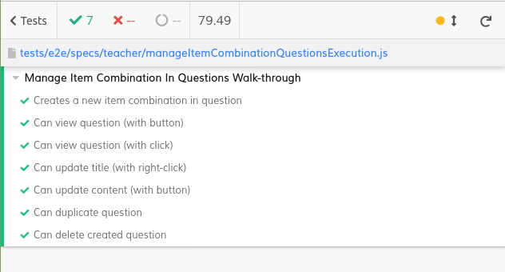

# ES21 P3 submission, Group 06

## Feature PRA

### Subgroup

 - Martim Ruggeroni Roquette Belo, ist194072, MartimBello
   + Issues assigned: [#126](https://github.com/tecnico-softeng/es21-g06/issues/126), [#132](https://github.com/tecnico-softeng/es21-g06/issues/132), [#139](https://github.com/tecnico-softeng/es21-g06/issues/139), [#141](https://github.com/tecnico-softeng/es21-g06/issues/141), [#145](https://github.com/tecnico-softeng/es21-g06/issues/145)
 - Martim Peixoto e Bourbon de Sampayo Pimentel, ist193738, MartimPimentel
   + Issues assigned: [#126](https://github.com/tecnico-softeng/es21-g06/issues/126), [#134](https://github.com/tecnico-softeng/es21-g06/issues/134), [#140](https://github.com/tecnico-softeng/es21-g06/issues/140), [#142](https://github.com/tecnico-softeng/es21-g06/issues/142), [#159](https://github.com/tecnico-softeng/es21-g06/issues/159)
 
### Pull requests associated with this feature

The list of pull requests associated with this feature is:

 - [PR #127](https://github.com/tecnico-softeng/es21-g06/pull/127)
 - [PR #133](https://github.com/tecnico-softeng/es21-g06/pull/133)
 - [PR #155](https://github.com/tecnico-softeng/es21-g06/pull/155)
 - [PR #155](https://github.com/tecnico-softeng/es21-g06/pull/155)
 - [PR #160](https://github.com/tecnico-softeng/es21-g06/pull/160)

### Frontend

#### New/Updated Views

- [OpenAnswerCreate](https://github.com/tecnico-softeng/es21-g06/blob/develop/frontend/src/components/open-answer/OpenAnswerCreate.vue)
- [OpenAnswerView](https://github.com/tecnico-softeng/es21-g06/blob/develop/frontend/src/components/open-answer/OpenAnswerView.vue)

#### New/Updated Models

- [OpenAnswerQuestionDetails](https://github.com/tecnico-softeng/es21-g06/blob/develop/frontend/src/models/management/questions/OpenAnswerQuestionDetails.ts)

### End-to-end tests

#### Created tests

- [Create Open Answer Question](https://github.com/tecnico-softeng/es21-g06/blob/develop/frontend/tests/e2e/specs/teacher/manageOpenAnswerQuestionsExecution.js#L56)
- [View Open Answer Question with right click](https://github.com/tecnico-softeng/es21-g06/blob/develop/frontend/tests/e2e/specs/teacher/manageOpenAnswerQuestionsExecution.js#L125)
- [View Open Answer Question with button](https://github.com/tecnico-softeng/es21-g06/blob/develop/frontend/tests/e2e/specs/teacher/manageOpenAnswerQuestionsExecution.js#L105)
- [Update Open Answer Question title with right click](https://github.com/tecnico-softeng/es21-g06/blob/develop/frontend/tests/e2e/specs/teacher/manageOpenAnswerQuestionsExecution.js#L141)
- [Update Open Answer Question content with button](https://github.com/tecnico-softeng/es21-g06/blob/develop/frontend/tests/e2e/specs/teacher/manageOpenAnswerQuestionsExecution.js#L178)
- [Duplicate Open Answer Question](https://github.com/tecnico-softeng/es21-g06/blob/develop/frontend/tests/e2e/specs/teacher/manageOpenAnswerQuestionsExecution.js#L219)
- [Delete Open Answer Question](https://github.com/tecnico-softeng/es21-g06/blob/develop/frontend/tests/e2e/specs/teacher/manageOpenAnswerQuestionsExecution.js#L263)

#### Commands defined

 - [database.js](https://github.com/tecnico-softeng/es21-g06/blob/develop/frontend/tests/e2e/support/database.js#L123)

#### Screenshot of test results overview

---

## Feature PEM

### Subgroup

- António Elias, ist193690, antoniopelias
   + Issues assigned: [#129](https://github.com/tecnico-softeng/es21-g06/issues/129), [#130](https://github.com/tecnico-softeng/es21-g06/issues/130), [#131](https://github.com/tecnico-softeng/es21-g06/issues/131), [#147](https://github.com/tecnico-softeng/es21-g06/issues/147), [#148](https://github.com/tecnico-softeng/es21-g06/issues/148), [#149](https://github.com/tecnico-softeng/es21-g06/issues/149), [#150](https://github.com/tecnico-softeng/es21-g06/issues/150), [#151](https://github.com/tecnico-softeng/es21-g06/issues/151), [#152](https://github.com/tecnico-softeng/es21-g06/issues/152), [#153](https://github.com/tecnico-softeng/es21-g06/issues/153)

- Rúben Inácio, ist193755, ruben-inacio
   + Issues assigned: [#129](https://github.com/tecnico-softeng/es21-g06/issues/129), [#130](https://github.com/tecnico-softeng/es21-g06/issues/130), [#131](https://github.com/tecnico-softeng/es21-g06/issues/131), [#147](https://github.com/tecnico-softeng/es21-g06/issues/147), [#148](https://github.com/tecnico-softeng/es21-g06/issues/148), [#149](https://github.com/tecnico-softeng/es21-g06/issues/149), [#150](https://github.com/tecnico-softeng/es21-g06/issues/150), [#151](https://github.com/tecnico-softeng/es21-g06/issues/151), [#152](https://github.com/tecnico-softeng/es21-g06/issues/152), [#153](https://github.com/tecnico-softeng/es21-g06/issues/153)

### Pull requests associated with this feature

The list of pull requests associated with this feature is:

- [PR #128](https://github.com/tecnico-softeng/es21-g06/pull/128)
- [PR #135](https://github.com/tecnico-softeng/es21-g06/pull/135)
- [PR #137](https://github.com/tecnico-softeng/es21-g06/pull/137)
- [PR #154](https://github.com/tecnico-softeng/es21-g06/pull/154)
- [PR #156](https://github.com/tecnico-softeng/es21-g06/pull/156)

### Frontend

#### New/Updated Views

- [MultipleChoiceCreate](https://github.com/tecnico-softeng/es21-g06/blob/develop/frontend/src/components/multiple-choice/MultipleChoiceCreate.vue)
- [MultipleChoiceView](https://github.com/tecnico-softeng/es21-g06/blob/develop/frontend/src/components/multiple-choice/MultipleChoiceView.vue)

#### New/Updated Models

- [Option](https://github.com/tecnico-softeng/es21-g06/blob/develop/frontend/src/models/management/Option.ts)
- [MultipleChoiceQuestionDetails](https://github.com/tecnico-softeng/es21-g06/blob/develop/frontend/src/models/management/questions/MultipleChoiceQuestionDetails.ts)

### End-to-end tests

#### Created tests

- [Create Multiple Choice Question](https://github.com/tecnico-softeng/es21-g06/blob/develop/frontend/tests/e2e/specs/teacher/manageMultipleChoiceSortingQuestionExecution.js#L72)
- [View Multiple Choice Question with right click](https://github.com/tecnico-softeng/es21-g06/blob/develop/frontend/tests/e2e/specs/teacher/manageMultipleChoiceSortingQuestionExecution.js#L147)
- [View Multiple Choice Question with button](https://github.com/tecnico-softeng/es21-g06/blob/develop/frontend/tests/e2e/specs/teacher/manageMultipleChoiceSortingQuestionExecution.js#L128)
- [Update Multiple Choice Question title with right click](https://github.com/tecnico-softeng/es21-g06/blob/develop/frontend/tests/e2e/specs/teacher/manageMultipleChoiceSortingQuestionExecution.js#L162)
- [Update Multiple Choice Question content with button](https://github.com/tecnico-softeng/es21-g06/blob/develop/frontend/tests/e2e/specs/teacher/manageMultipleChoiceSortingQuestionExecution.js#L198)
- [Duplicate Multiple Choice Question](https://github.com/tecnico-softeng/es21-g06/blob/develop/frontend/tests/e2e/specs/teacher/manageMultipleChoiceSortingQuestionExecution.js#L234)
- [Delete Multiple Choice Question](https://github.com/tecnico-softeng/es21-g06/blob/develop/frontend/tests/e2e/specs/teacher/manageMultipleChoiceSortingQuestionExecution.js#L285)

#### Screenshot of test results overview

---

## Feature PCI

### Subgroup

- André Mendes, ist193684, kabux3
   + Issues assigned: [#125](https://github.com/tecnico-softeng/es21-g06/issues/125), [#136](https://github.com/tecnico-softeng/es21-g06/issues/136), [#143](https://github.com/tecnico-softeng/es21-g06/issues/143), [#146](https://github.com/tecnico-softeng/es21-g06/issues/146)

- Vasco Simões, ist193761, vascosim
   + Issues assigned: [#125](https://github.com/tecnico-softeng/es21-g06/issues/125), [#136](https://github.com/tecnico-softeng/es21-g06/issues/136), [#143](https://github.com/tecnico-softeng/es21-g06/issues/143), [#146](https://github.com/tecnico-softeng/es21-g06/issues/146)

### Pull requests associated with this feature

The list of pull requests associated with this feature is:

- [PR #138](https://github.com/tecnico-softeng/es21-g06/pull/138)
- [PR #144](https://github.com/tecnico-softeng/es21-g06/pull/144)
- [PR #157](https://github.com/tecnico-softeng/es21-g06/pull/157)
- [PR #158](https://github.com/tecnico-softeng/es21-g06/pull/158)
- [PR #161](https://github.com/tecnico-softeng/es21-g06/pull/161)
- [PR #162](https://github.com/tecnico-softeng/es21-g06/pull/162)
- [PR #163](https://github.com/tecnico-softeng/es21-g06/pull/163)
- [PR #164](https://github.com/tecnico-softeng/es21-g06/pull/164)

### Frontend

#### New/Updated Views

- [ItemCombinationCreate](https://github.com/tecnico-softeng/es21-g06/blob/develop/frontend/src/components/item-combination/ItemCombinationCreate.vue)
- [ItemCombinationItems](https://github.com/tecnico-softeng/es21-g06/blob/develop/frontend/src/components/item-combination/ItemCombinationItems.vue)
- [ItemCombinationCombinations](https://github.com/tecnico-softeng/es21-g06/blob/develop/frontend/src/components/item-combination/ItemCombinationCombinations.vue)
- [ItemCombinationView](https://github.com/tecnico-softeng/es21-g06/blob/develop/frontend/src/components/item-combination/ItemCombinationView.vue)
- [EditQuestionDialog](https://github.com/tecnico-softeng/es21-g06/blob/develop/frontend/src/views/teacher/questions/EditQuestionDialog.vue)
- [ShowQuestion](https://github.com/tecnico-softeng/es21-g06/blob/develop/frontend/src/views/teacher/questions/ShowQuestion.vue)

#### New/Updated Models

- [Item](https://github.com/tecnico-softeng/es21-g06/blob/develop/frontend/src/models/management/Item.ts)
- [ItemGroup](https://github.com/tecnico-softeng/es21-g06/blob/develop/frontend/src/models/management/questions/ItemGroup.ts)
- [ItemCombinationAnswerType](https://github.com/tecnico-softeng/es21-g06/blob/develop/frontend/src/models/management/questions/ItemCombinationAnswerType.ts)
- [ItemCombinationQuestionDetails](https://github.com/tecnico-softeng/es21-g06/blob/develop/frontend/src/models/management/questions/ItemCombinationQuestionDetails.ts)
- [ItemCombinationStatementQuestionDetails](https://github.com/tecnico-softeng/es21-g06/blob/develop/frontend/src/models/statement/questions/ItemCombinationStatementQuestionDetails.ts)
- [ItemCombinationStatementAnswerDetails](https://github.com/tecnico-softeng/es21-g06/blob/develop/frontend/src/models/statement/questions/ItemCombinationStatementAnswerDetails.ts)
- [ItemCombinationStatementCorrectAnswerDetails](https://github.com/tecnico-softeng/es21-g06/blob/develop/frontend/src/models/statement/questions/ItemCombinationStatementCorrectAnswerDetails.ts)

### End-to-end tests

#### Created tests

- [Create Item Combination Question](https://github.com/tecnico-softeng/es21-g06/blob/develop/frontend/tests/e2e/specs/teacher/manageItemCombinationQuestionsExecution.js#L56)
- [View Item Combination Question with button](https://github.com/tecnico-softeng/es21-g06/blob/develop/frontend/tests/e2e/specs/teacher/manageItemCombinationQuestionsExecution.js#L126)
- [View Item Combination Question right click](https://github.com/tecnico-softeng/es21-g06/blob/develop/frontend/tests/e2e/specs/teacher/manageItemCombinationQuestionsExecution.js#L146)
- [Update Item Combination Question title with right click](https://github.com/tecnico-softeng/es21-g06/blob/develop/frontend/tests/e2e/specs/teacher/manageItemCombinationQuestionsExecution.js#L162)
- [Update Item Combination Question content with button](https://github.com/tecnico-softeng/es21-g06/blob/develop/frontend/tests/e2e/specs/teacher/manageItemCombinationQuestionsExecution.js#L196)
- [Duplicate Item Combination Question](https://github.com/tecnico-softeng/es21-g06/blob/develop/frontend/tests/e2e/specs/teacher/manageItemCombinationQuestionsExecution.js#L247)
- [Delete Item Combination Question](https://github.com/tecnico-softeng/es21-g06/blob/develop/frontend/tests/e2e/specs/teacher/manageItemCombinationQuestionsExecution.js#L290)

#### Commands defined

- [database.js](https://github.com/socialsoftware/quizzes-tutor/blob/master/frontend/tests/e2e/support/database.js)

#### Screenshot of test results overview

